# Create Presentations

**A provider-neutral Agent Skill for planning, designing, building, reviewing, and delivering presentations.**

[中文说明](README.zh-CN.md) · [Workflow](docs/WORKFLOW.md) · [Style gallery](docs/STYLE_GALLERY.md) · [Worked example](examples/create-presentations-overview/README.md) · [Influences](docs/INFLUENCES.md)


Turn a topic, a pile of source files, an existing deck, or a rough outline into a coherent presentation. Use Codex, Claude, GPT, Gemini, or another capable text model for reasoning—and route visuals to gpt-image-2, Nano Banana / Gemini Image, or another configured image backend.

The skill does not lock you into one provider or one output style. It helps the agent choose the right production route:

| Route | Best for | Delivery |
| --- | --- | --- |
| **Native** | Exact editable copy, charts, tables, and shapes | Editable PPTX |
| **Visual** | Maximum whole-slide visual fidelity | Image-based PPTX |
| **Hybrid** | High-fidelity visuals with editable key content | Editable + raster PPTX |
| **Template** | Existing brand masters and layouts | Template-faithful PPTX |
| **HTML** | Portable or interactive presentations | Browser-first HTML |

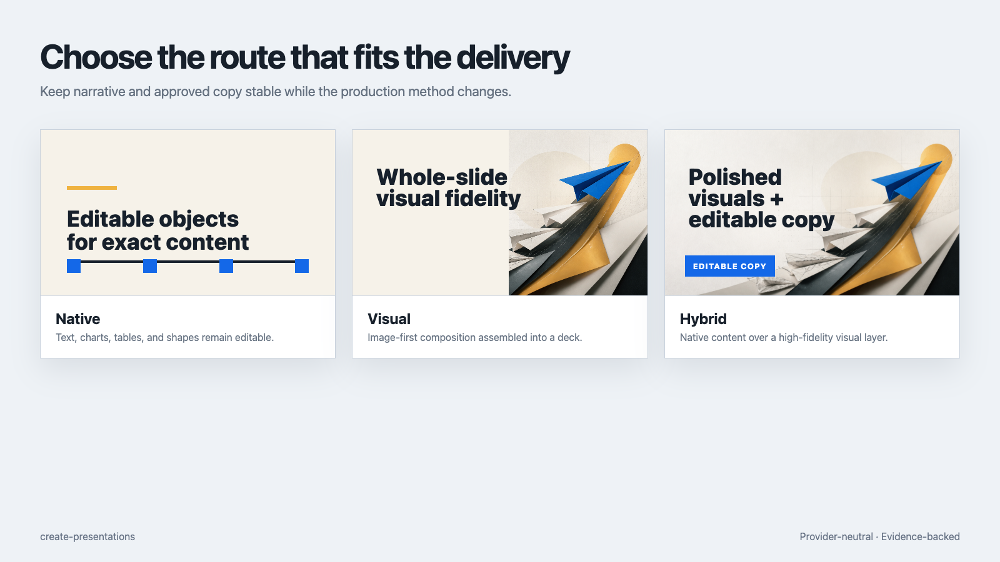

## Sixteen visual systems, one brief

The gallery holds the content constant and changes composition, typography, image treatment, and emotional tone. These are original full-slide image-generation outputs—not screenshots copied from public templates.

[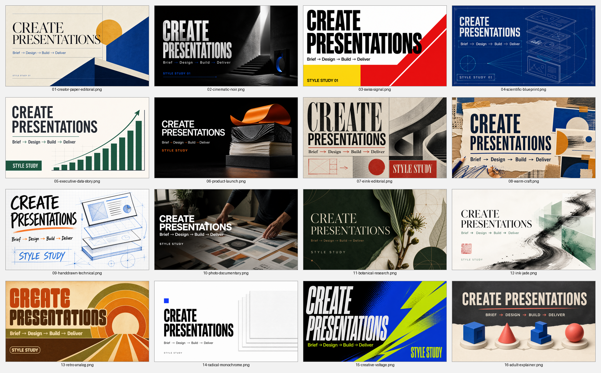](docs/STYLE_GALLERY.md)

| Creator Paper Editorial | Cinematic Noir |
| --- | --- |
| [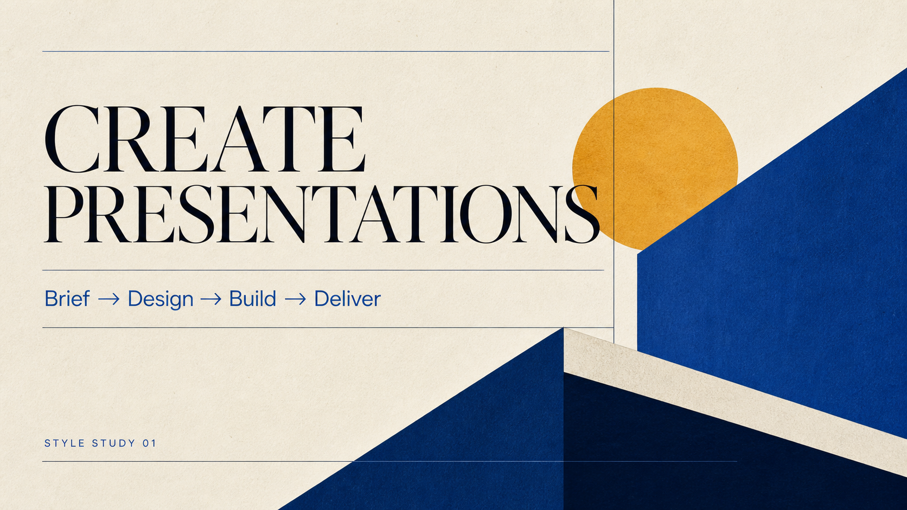](assets/style-gallery/01-creator-paper-editorial.png) | [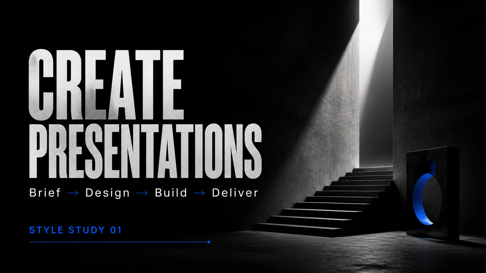](assets/style-gallery/02-cinematic-noir.png) |
| Scientific Blueprint | Warm Craft |
| [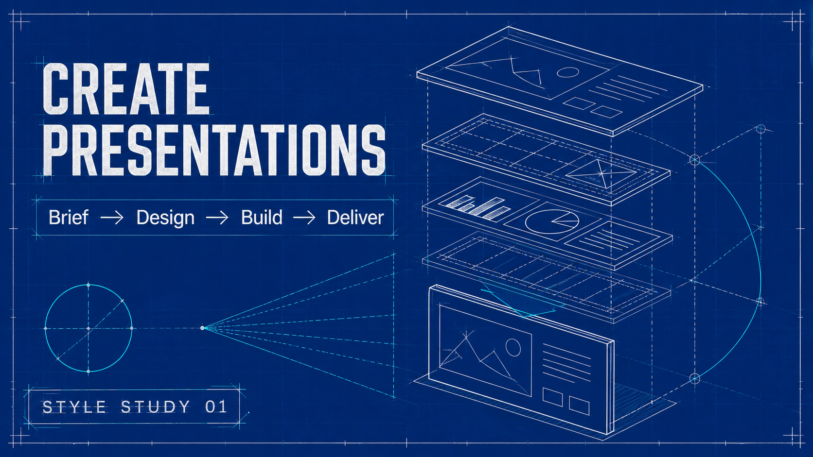](assets/style-gallery/04-scientific-blueprint.png) | [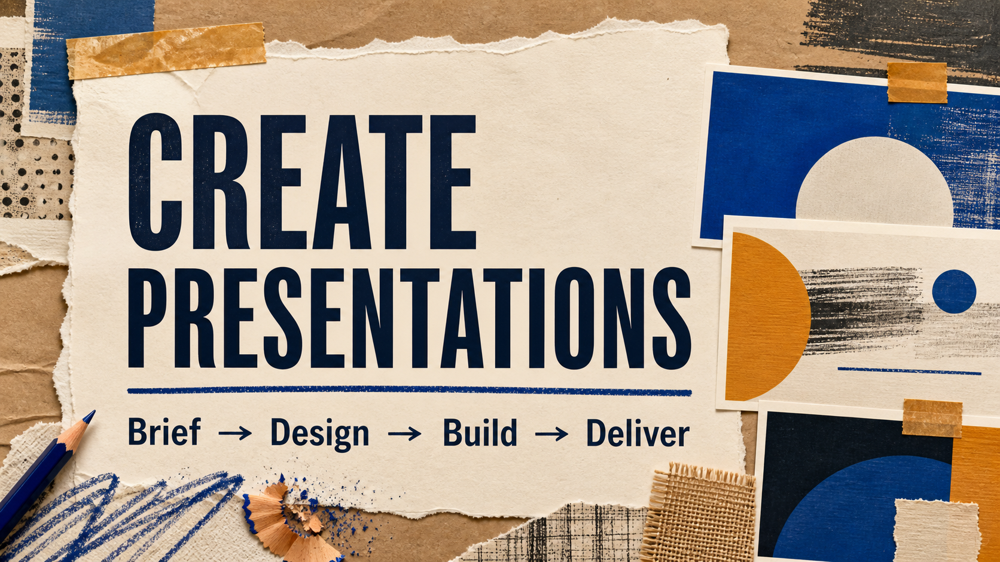](assets/style-gallery/08-warm-craft.png) |
| Photo Documentary | Ink & Jade |
| [](assets/style-gallery/10-photo-documentary.png) | [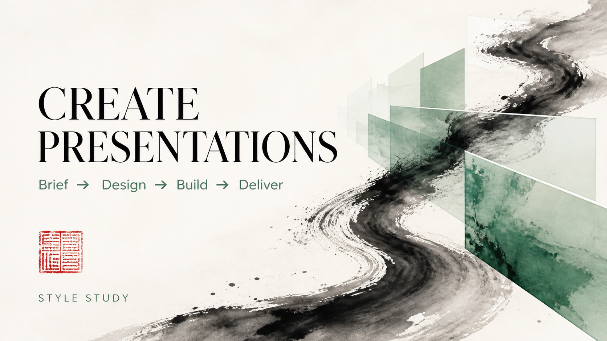](assets/style-gallery/12-ink-jade.png) |
| Retro Analog | Creative Voltage |
| [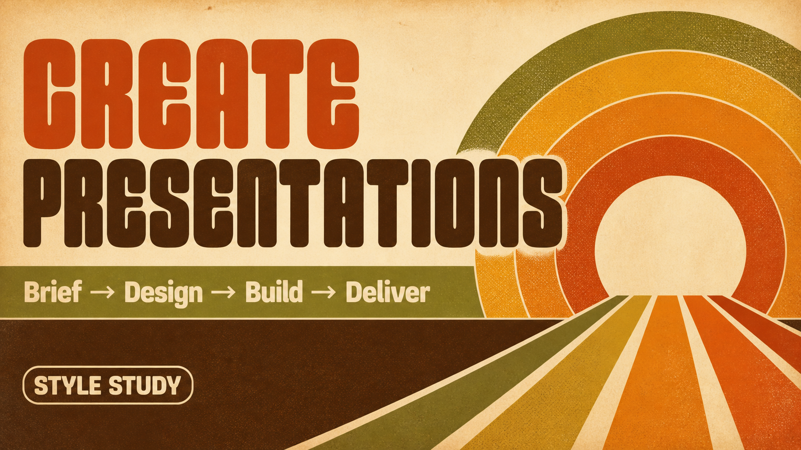](assets/style-gallery/13-retro-analog.png) | [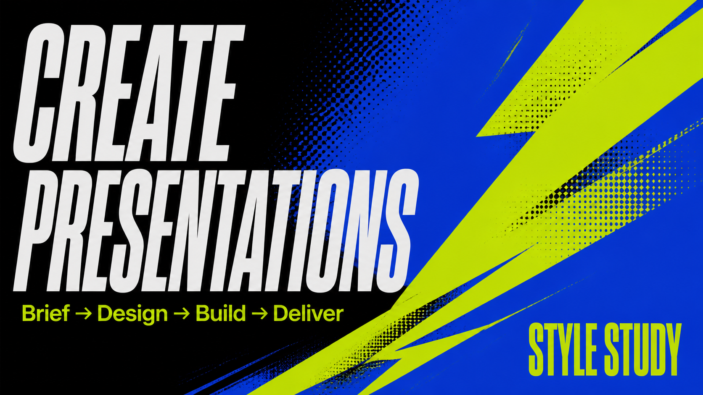](assets/style-gallery/15-creative-voltage.png) |

See the [complete style gallery](docs/STYLE_GALLERY.md) for all sixteen families, intended use, visual DNA, generation provenance, and selection guidance. The downloadable [Visual Locked style showcase](examples/create-presentations-overview/create-presentations-style-showcase.pptx) places every original image on its own full-slide PPTX page.

## Why this skill

Most slide workflows optimize either for editable objects or beautiful images. `create-presentations` keeps five things separate so you can revise one without restarting everything:

1. the narrative;
2. approved audience-visible copy;
3. deck-level visual direction;
4. model and renderer choices;
5. delivery formats and evidence.

It uses flexible page narratives instead of forcing every slide into a title/body/bullets schema. One deck normally uses one visual system, while page roles and silhouettes vary to keep the story moving.

## Install

Install with the open [`skills`](https://github.com/vercel-labs/skills) CLI:

```bash
# Codex
npx -y skills@latest add minoltaMF/create-presentations-skill \
  --skill create-presentations \
  --agent codex \
  --global

# Claude Code
npx -y skills@latest add minoltaMF/create-presentations-skill \
  --skill create-presentations \
  --agent claude-code \
  --global
```

List supported agents or install to another compatible environment:

```bash
npx -y skills@latest add minoltaMF/create-presentations-skill --list
```

Manual installation is also possible: copy `skills/create-presentations` into your agent's Skill directory, such as `~/.codex/skills/` or `~/.claude/skills/`, then restart the agent.

## Quick start

Mention the skill explicitly:

```text
Use $create-presentations to make a 12-slide launch deck for a technical audience.
Use Claude for narrative and gpt-image-2 for one representative visual sample.
Deliver a high-fidelity Visual PPTX, an editable Hybrid PPTX, and PDF.
```

Or start from files:

```text
Use $create-presentations. Read the attached PDF, DOCX, XLSX, and existing PPTX.
Extract the strongest evidence, preserve source links in speaker notes, and build a
15-slide presentation. Follow the supplied template and do not flatten its layouts.
```

For an existing deck:

```text
Use $create-presentations to audit and improve this PPTX. Preserve the brand,
logo, facts, notes, and master layouts. Fix the narrative, hierarchy, CJK
typography, crops, overflow, and repeated page silhouettes.
```

## Recommended workflow

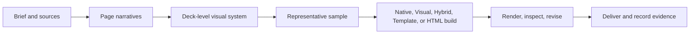

The sample step is useful when visual generation has meaningful cost or ambiguity; it is not a compulsory ceremony when the user already approved the direction and budget.

See [the full workflow](docs/WORKFLOW.md) and [copy-paste prompt recipes](docs/PROMPT_RECIPES.md).

## Model and tool routing

The skill separates model roles rather than treating one model as the entire pipeline:

- **Narrative and synthesis:** Codex, Claude, GPT, Gemini, or a capable local model.
- **Research:** any configured search/research tool with source capture.
- **Visual generation:** gpt-image-2, Nano Banana / Gemini Image, Ideogram, Flux, or another available image backend.
- **Rendering:** native presentation APIs, Artifact Tool, PptxGenJS, template-preserving tooling, or a portable HTML renderer.

No model, API key, image provider, or renderer is bundled or silently downloaded. The agent must use what is actually available in its environment.

## Quality principles

- One communication job per slide.
- One deck-level visual system by default.
- Audience-visible copy is distinct from prompts, notes, and production controls.
- Full-deck contact-sheet review plus full-size page inspection.
- Local repair before another paid image generation.
- Unexpected dates, percentages, filenames, URLs, or instruction leakage are reviewed rather than silently accepted.
- OCR can find copy drift; it must not rewrite approved source copy or decide whether a claim is true.
- Editable, rasterized, and unsupported regions are disclosed.

## Included packs

The installable Skill contains:

- `references/` — workflow, model routing, visual systems, QA, manifest, and influence boundaries;
- `assets/` — reusable Brief, page-plan, visible-copy, source-ledger, and QA templates;
- `scripts/validate_deck_manifest.py` — deterministic, provider-free delivery manifest validation;
- `agents/openai.yaml` — Codex UI metadata.

The repository also includes a complete [Create Presentations worked example](examples/create-presentations-overview/README.md), built with the Skill's own Brief, page-plan, Design DNA, route-selection, visible-copy, and QA logic. It includes editable/Hybrid PPTX, a 16-page Visual Locked style-showcase PPTX, a self-contained HTML presentation, manifests, renders, and source evidence.

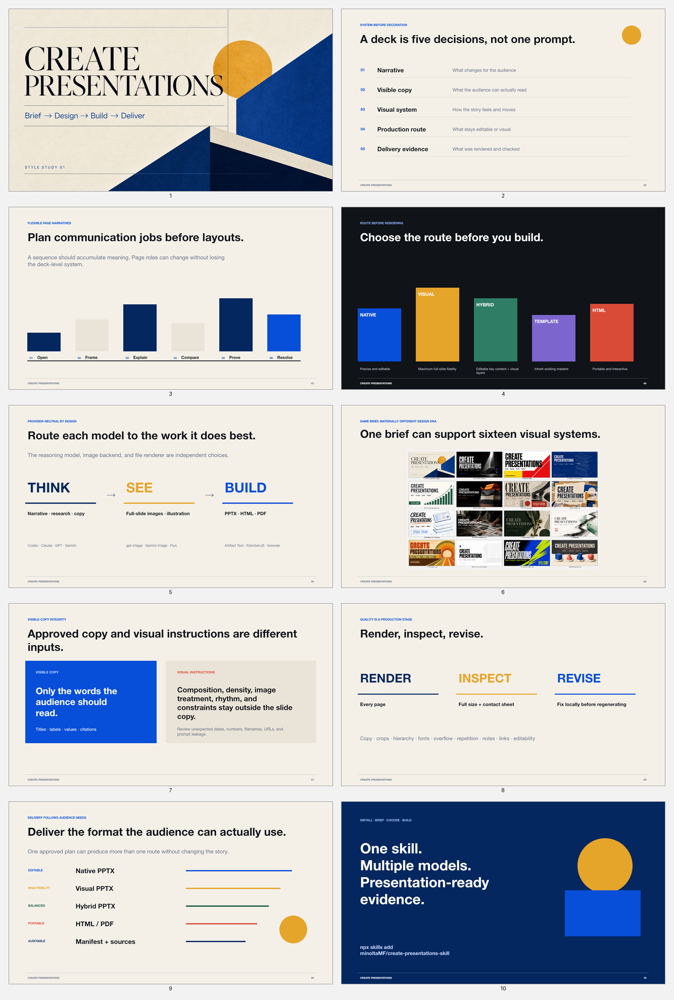

## Repository structure

```text
create-presentations-skill/
├── skills/create-presentations/   # installable Skill
│   ├── SKILL.md
│   ├── agents/
│   ├── assets/
│   ├── references/
│   └── scripts/
├── examples/create-presentations-overview/ # self-referential worked example
├── assets/style-gallery/           # 16 original full-slide style studies
├── assets/readme/                  # README demos and gallery montage
├── docs/                           # public documentation
└── scripts/validate_repo.py        # repository-level checks
```

## Validate locally

```bash
python3 skills/create-presentations/scripts/validate_deck_manifest.py --self-test
python3 scripts/validate_repo.py
```

## Credits and reuse boundary

This is an original, provider-neutral synthesis informed by open presentation and Agent Skill projects including [codex-ppt-skill](https://github.com/ningzimu/codex-ppt-skill), [Bento](https://github.com/nyblnet/bento), native PowerPoint tooling, template-following workflows, and Render–Inspect–Revise research.

The repository does not silently bundle those projects or their runtimes. See [Influences and licenses](docs/INFLUENCES.md).

## License

[MIT](LICENSE)
