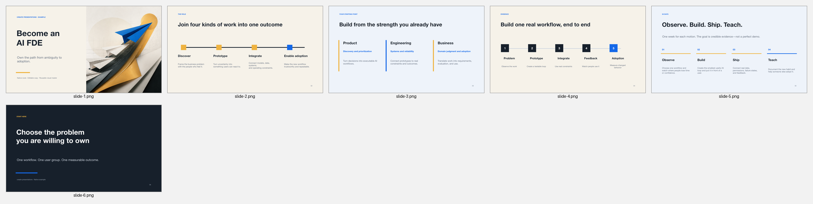

# Create Presentations

**一个与 Provider 无关、可跨 Agent 使用的专业演示文稿 Skill。**

[English](README.md) · [完整流程](docs/WORKFLOW.md) · [案例](examples/ai-fde-career/README.md) · [参考来源](docs/INFLUENCES.md)


它可以从主题、零散材料、研究报告、已有 PPTX 或一段粗略提纲开始，协助完成：

`Brief → 逐页叙事 → 整套视觉系统 → 样张 → 生成 → 检查修复 → 多格式交付`

文字推理可以使用 Codex、Claude、GPT、Gemini 或其他模型；视觉生成可以使用 gpt-image-2、Nano Banana / Gemini Image 或其他已配置的生图模型。

## 五种制作路线

| 路线 | 适用场景 | 交付结果 |
| --- | --- | --- |
| **Native** | 文字、图表、表格和形状需要精确编辑 | 可编辑 PPTX |
| **Visual** | 优先保证整页视觉品质 | 图片式高保真 PPTX |
| **Hybrid** | 同时需要视觉品质和关键内容可编辑 | 原生对象 + 栅格视觉 PPTX |
| **Template** | 已有品牌模板、母版和版式 | 模板忠实 PPTX |
| **HTML** | 便携、互动或浏览器演示 | HTML 演示 |


## 安装

使用通用 `skills` CLI：

```bash
# Codex
npx -y skills@latest add minoltaMF/create-presentations-skill \
  --skill create-presentations \
  --agent codex \
  --global

# Claude Code
npx -y skills@latest add minoltaMF/create-presentations-skill \
  --skill create-presentations \
  --agent claude-code \
  --global
```

查看可安装 Skill 和支持的 Agent：

```bash
npx -y skills@latest add minoltaMF/create-presentations-skill --list
```

也可以手动把 `skills/create-presentations` 复制到 `~/.codex/skills/`、`~/.claude/skills/` 或其他兼容 Agent 的 Skill 目录。

## 快速使用

```text
使用 $create-presentations，制作一套“如何转型 AI FDE 工程师”的 12 页课程宣传 PPT。
使用 Claude 整理叙事，gpt-image-2 先生成一页视觉样张。
最终交付高保真 Visual PPTX、可编辑 Hybrid PPTX 和 PDF。
```

从材料开始：

```text
使用 $create-presentations，读取我提供的 PDF、Word、Excel 和已有 PPTX。
提取可用观点、事实和数据，将来源写入讲者备注，规划 15 页演示。
严格沿用已有模板，不要把母版和布局扁平化。
```

优化已有 PPT：

```text
使用 $create-presentations 审查并优化这份 PPTX。
保留品牌、Logo、事实、讲者备注和母版。
重点修复叙事、层级、中文字体、图片裁切、溢出和重复版式。
```

## 核心特点

- 不把所有页面锁死为“标题、正文、三个要点”。
- 默认一套演示只确定一次整体视觉系统。
- 文案模型、研究工具、生图模型和文件 Renderer 可以分别选择。
- 生成后必须 Render–Inspect–Revise，而不是只相信模型输出。
- 优先人工复核或本地确定性修复，再决定是否增加一次付费生图。
- 可见文案与提示词、构图说明、备注和模型控制信息严格分离。
- 不把 OCR 识别结果反向写成用户批准的正文。
- 明确说明哪些区域可编辑、哪些区域保持栅格。

## 完整案例和素材包

仓库提供了一个完整的 [AI FDE 转型演示案例](examples/ai-fde-career/README.md)，包含：

- Presentation Brief；
- 逐页叙事计划；
- 来源台账；
- 可下载 PPTX；
- HTML 演示；
- 页面预览图与联系表；
- 交付 Manifest。



安装包内还提供 Brief、页面计划、可见文案、来源台账和 QA 清单模板，可以直接复制到新项目。

## 验证

```bash
python3 skills/create-presentations/scripts/validate_deck_manifest.py --self-test
python3 scripts/validate_repo.py
```

## 开源参考边界

本项目综合参考了 [codex-ppt-skill](https://github.com/ningzimu/codex-ppt-skill)、[Bento](https://github.com/nyblnet/bento)、原生 PPTX 工具、模板跟随方案和 Render–Inspect–Revise 研究中的成熟思路。

仓库不会暗中打包或执行这些上游项目。完整参考与许可证说明见 [docs/INFLUENCES.md](docs/INFLUENCES.md)。

## License

[MIT](LICENSE)
